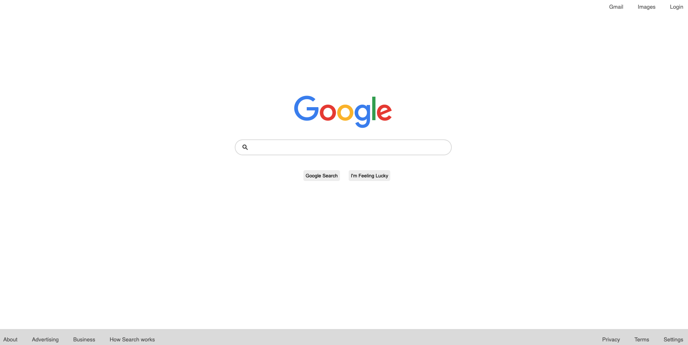

# Goal

To deconstruct an existing Google web page and rebuilt it to make it **look** like google.com.

# What did I learn

- Don't be fooled by the minimalist sleek UI. There is a great deal of work and attention that goes into it.
  Learned the hard way:)
- I am no longer an HTML/CSS noob.

[Check out this live preview](https://nskills-lab.github.io/google-homepage/)
